# Showcase

The repo includes a local showcase store named **Northstar Supply**. It is
generic demo content used for screenshots and QA. It is not a real store,
and it should not be deployed as production content.

## What It Seeds

`./scripts/seed-showcase.sh` replaces the local product catalog and writes a
complete WCHS demo configuration:

- Six WooCommerce products with generated product photos.
- Product categories, cross-sells, and a few local product reviews.
- Homepage hero, trust bar, product slider, split feature block, category
  grid, and FAQ accordion.
- Shop and PDP module settings.
- Two SPA content pages: `/about` and `/faq`.
- Neutral header, footer, design tokens, product card settings, empty
  integration fields, the default Script Registry, and no active Site
  Scripts.

The script refuses non-local `WP_SITE_URL` values unless
`WCHS_ALLOW_SHOWCASE_RESET=1` is set. It deletes the local catalog on
purpose, so only use it in disposable development environments.

For clean screenshots, it also deactivates active non-WooCommerce plugins in
the local WordPress install. Set `WCHS_SHOWCASE_KEEP_PLUGINS=1` if you need
to preserve optional plugin state while refreshing the showcase content.

## Commands

Default local flow:

```sh
./scripts/up.sh
./scripts/seed.sh
./scripts/seed-showcase.sh
cd spa && npm install && npm run dev
```

If `5175` is already occupied, run Vite on another port and tell the
showcase seed where the admin preview iframe should point:

```sh
cd spa && npx vite dev --host localhost --port 5185 --strictPort
WCHS_SHOWCASE_SPA_ORIGIN=http://localhost:5185 ./scripts/seed-showcase.sh
```

## Storefront

<p>
  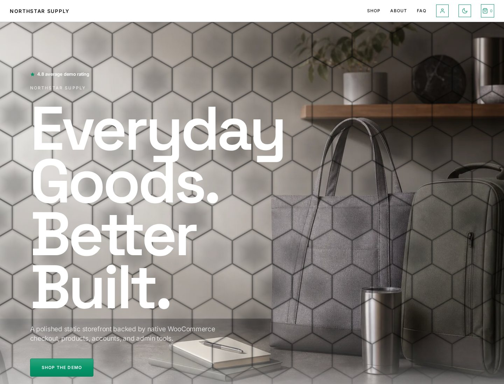
  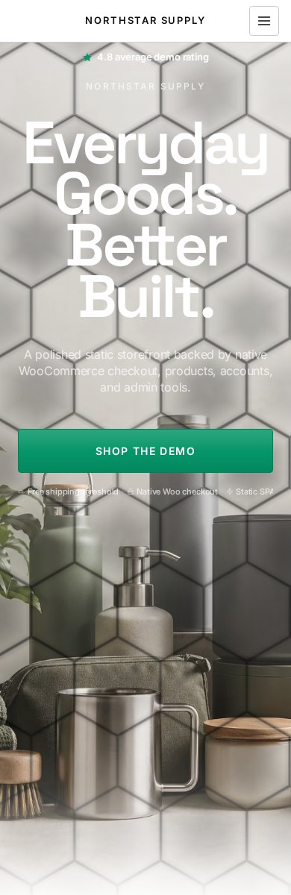
</p>

<p>
  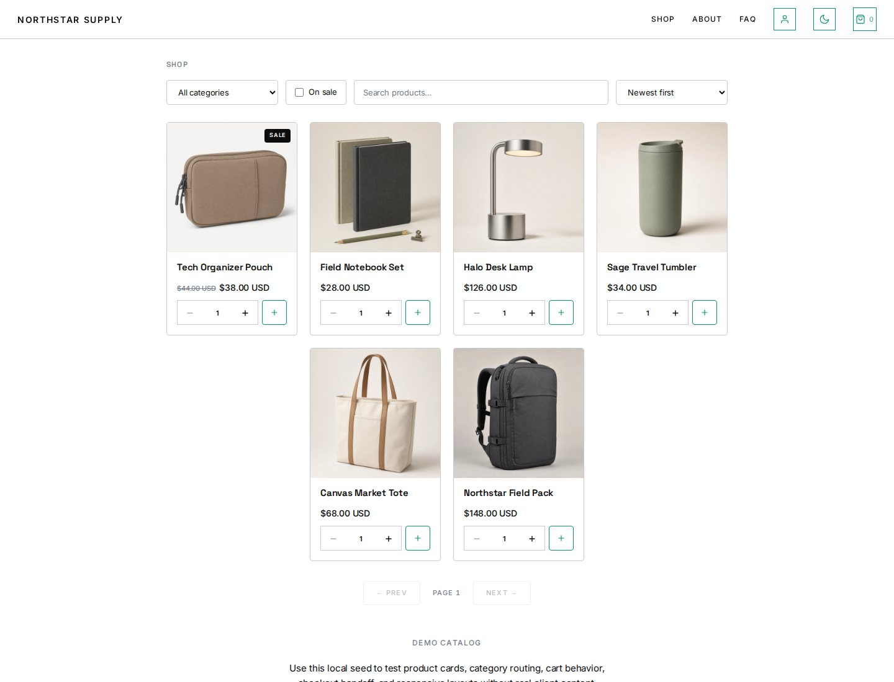
  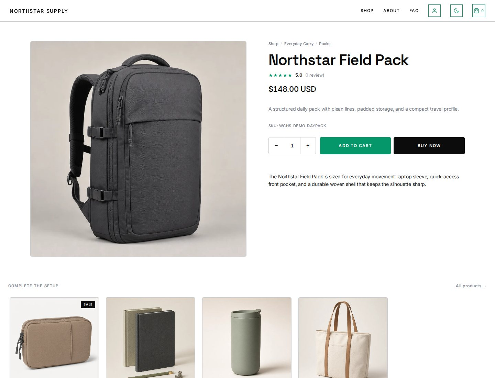
</p>

## Admin Studio

<p>
  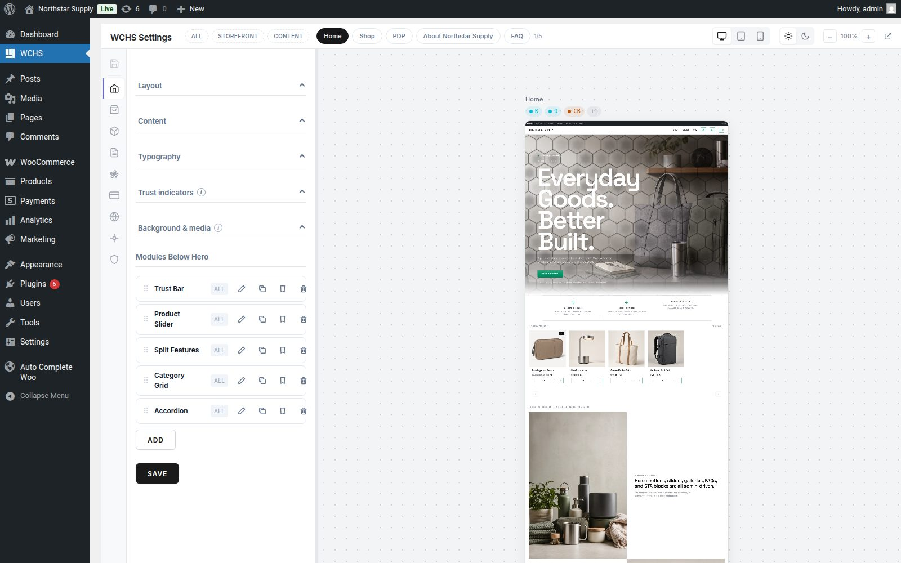
  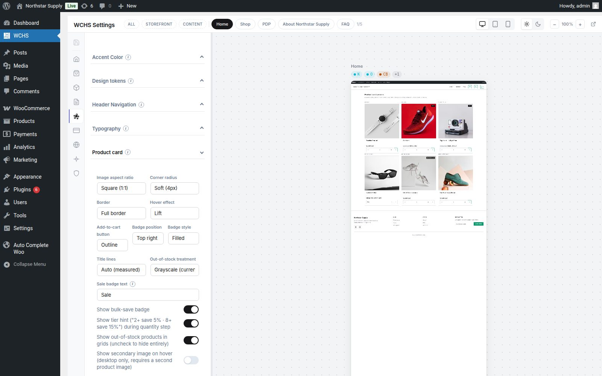
</p>

<p>
  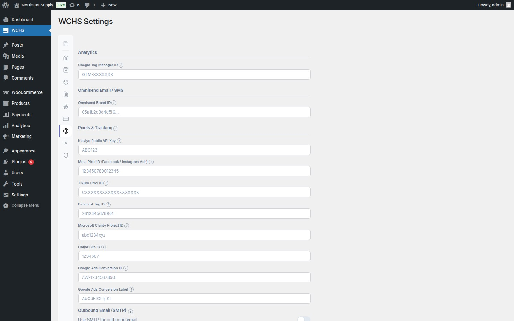
</p>

## WebGL Hero Variants

The hero can render a normal image treatment or a WebGL overlay. The demo
captures four variants from the same seeded homepage content:

<p>
  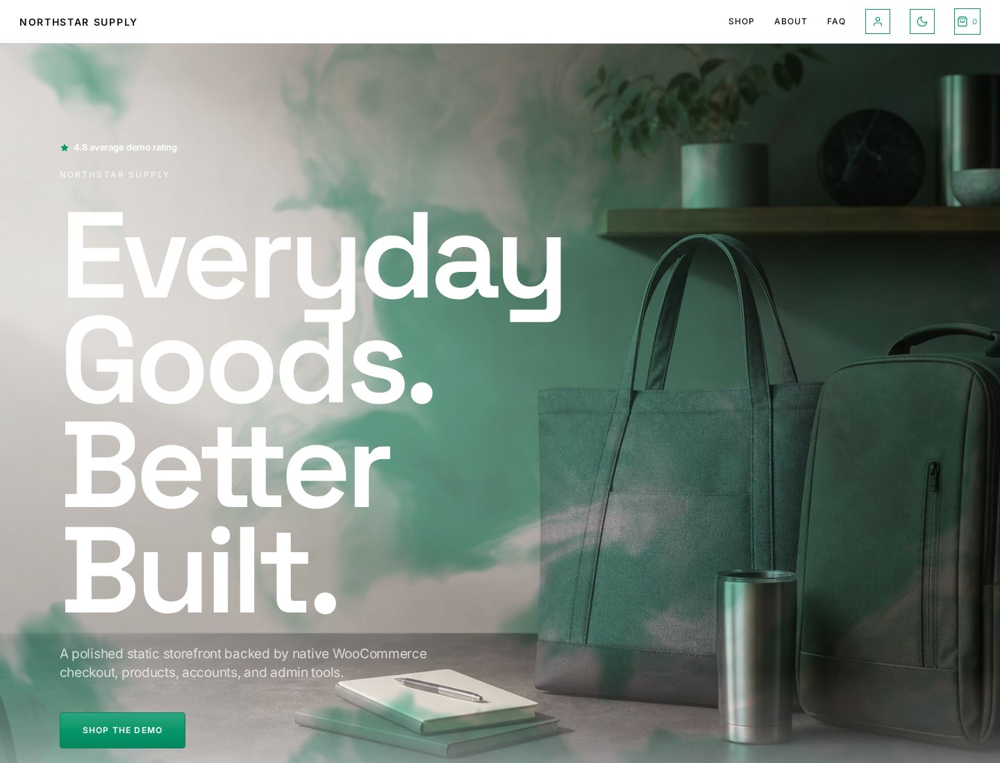
  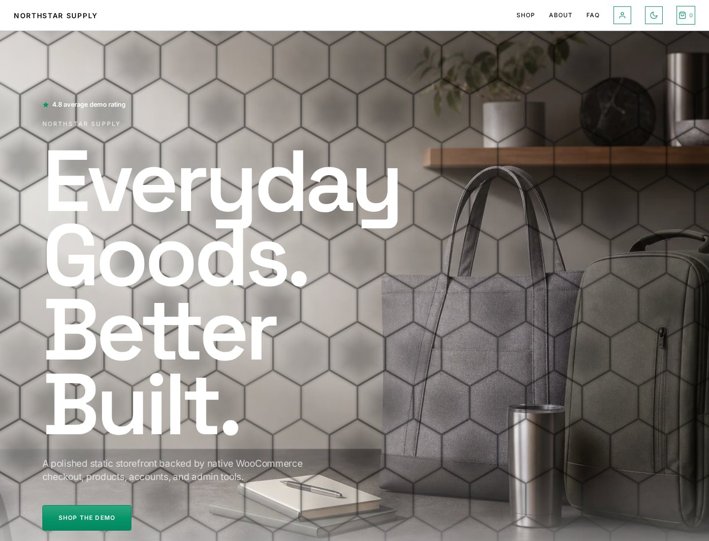
</p>

<p>
  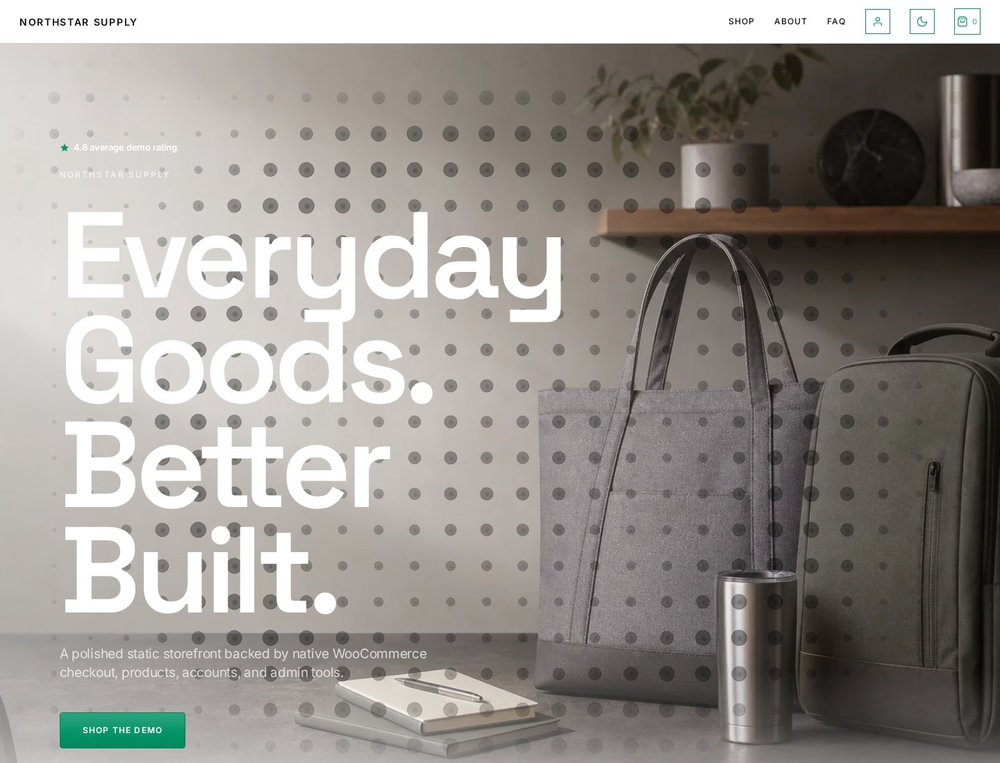
  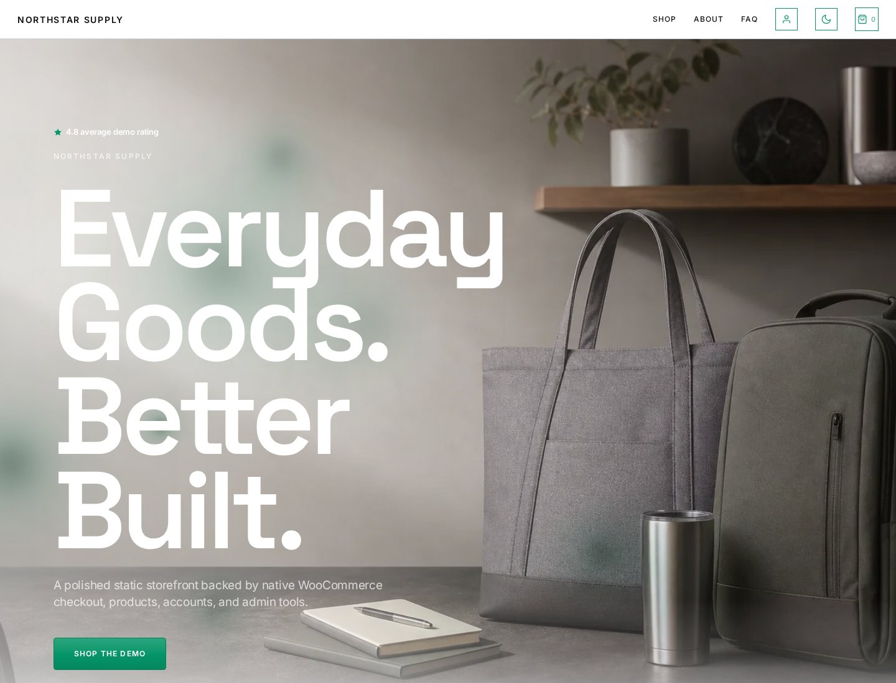
</p>

## Generated Assets

The generated assets live under `docs/assets/showcase/generated/`. They are
committed so README screenshots and local seeds do not depend on an external
image service.

| Asset | Used for |
|---|---|
| `hero-desktop.webp` | Homepage and module hero background. |
| `hero-mobile.webp` | Mobile hero background and split feature image. |
| `product-daypack.webp` | Northstar Field Pack. |
| `product-tote.webp` | Canvas Market Tote. |
| `product-tumbler.webp` | Sage Travel Tumbler. |
| `product-lamp.webp` | Halo Desk Lamp. |
| `product-notebook.webp` | Field Notebook Set. |
| `product-pouch.webp` | Tech Organizer Pouch. |

The current asset set was generated with OpenAI `gpt-image-2`, then
compressed to WebP before commit.
